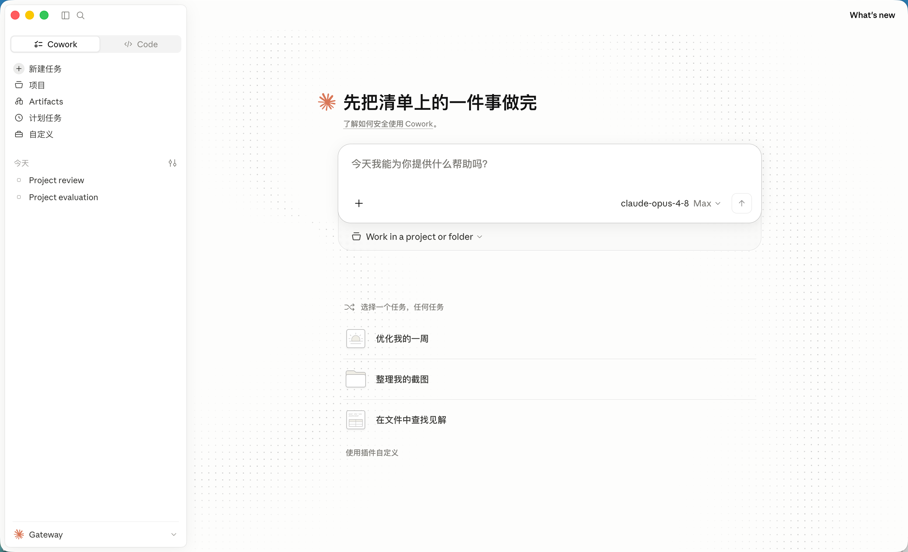

# Claude Desktop 中文补丁 · 轻量版

[](https://www.python.org/)
[](LICENSE)
[]()

> 🚀 最简洁的 Claude Desktop 中文化方案 —— 一个 Python 脚本，几秒钟安装，不碰 app.asar。

简体中文 | [更新日志](CHANGELOG.md) | [贡献指南](CONTRIBUTING.md)



---

## 这是什么

给 Claude Desktop 添加中文界面的补丁。它只做三件最核心的事：

1. 把中文翻译文件复制到 Claude 的资源目录
2. 把中文加进前端的语言白名单（让"语言"菜单里出现中文选项）
3. 把用户配置的语言设为中文

支持简体中文、繁体中文（中国台湾）、繁体中文（中国香港）。

此外，可选地往 Claude 的 system prompt 注入一句中文指令，让 Claude 默认用简体中文回答和写代码注释。

## 快速开始

### macOS

```bash
git clone https://github.com/sheldum03/claude-cowork-cn.git
cd claude-cowork-cn

# 方式一：双击 install-mac.command
# 方式二：命令行
sudo python3 install.py
```

### Windows

```powershell
git clone https://github.com/sheldum03/claude-cowork-cn.git
cd claude-cowork-cn

# 方式一：右键 install-windows.bat -> 以管理员身份运行
# 方式二：管理员 PowerShell
python install.py
```

安装后重启 Claude Desktop，点击左下角头像 → Language → 选择中文。

## 命令行参数

```bash
python3 install.py                     # 交互式选择语言（并询问是否注入中文指令）
python3 install.py --lang zh-CN        # 指定语言，跳过语言选择
python3 install.py --system-prompt     # 注入中文 system prompt 指令，跳过询问
python3 install.py --no-system-prompt  # 不注入中文 system prompt 指令，跳过询问
python3 install.py --restore           # 恢复：移除中文文件、重置为英文、清除注入的指令
python3 install.py --dry-run           # 预演，不实际修改任何文件
```

## 让 Claude 默认用中文回答

除了界面汉化，本工具还能可选地让 Claude **默认用简体中文回答和写代码注释**。

原理：往 Claude 的全局指令文件 `~/.claude/CLAUDE.md` 写入一句指令：

> 请一律使用简体中文进行回答和代码注释。

这是 Claude 官方支持的全局指令机制，纯文本写入、零风险。安装时会询问是否启用，也可用 `--system-prompt` / `--no-system-prompt` 直接指定。写入的内容用注释标记包裹，`--restore` 时会被干净移除，不影响你 `CLAUDE.md` 里的其他内容。


## 翻译覆盖范围（请如实知悉）

✅ **会被翻译**
- 主界面（聊天窗口、侧边栏）
- 设置页面
- 常见对话框和提示
- 基本功能按钮

❌ **不会被翻译**（轻量版的取舍）
- 系统菜单栏（File、Edit、View 等）
- 在线 claude.ai 页面的部分内容
- 少量硬编码在 JS 里的英文文本

如需上述部分也完整汉化，请使用[完整版](https://github.com/javaht/claude-desktop-zh-cn)。

## 系统要求

- macOS 10.14+ 或 Windows 10+
- Python 3.7+
- 已安装官方 Claude Desktop

## 常见问题

**Q: 安装后还是英文？**
完全退出并重启 Claude，然后在左下角头像 → Language 里手动切换一次。

**Q: Claude 更新后中文没了？**
更新会覆盖翻译文件，重新运行一次安装脚本即可。

**Q: 部分界面还是英文，是 bug 吗？**
不是。轻量版只覆盖约 70% 界面，系统菜单和在线页面部分内容保持英文是正常现象。

**Q: 会不会破坏 Claude？**
本项目不修改 app.asar、不重签名，只复制资源文件和改一行配置，风险很低。如需还原可运行 `--restore` 或重装 Claude。

**Q: 怎么卸载？**
运行 `python3 install.py --restore`。

## 工作原理

`install.py` 是一个无第三方依赖的单文件脚本，做的事很直白：

```
1. 定位 Claude 安装目录（macOS/Windows 自动识别）
2. 把 resources/ 里的翻译 JSON 合并/复制到 Claude 的 i18n 目录
   （与 Claude 自带的 en-US.json 按 key 合并，未翻译的回退英文）
3. 用正则在前端 JS bundle 的语言数组里追加中文代码
4. 把 ~/.../Claude/config.json 的 locale 设为所选语言
```

没有二进制操作，没有完整性哈希，没有签名——这就是它轻量的原因。

## 致谢

翻译资源（`resources/` 下的 JSON 与 .strings 文件）来自
[javaht/claude-desktop-zh-cn](https://github.com/javaht/claude-desktop-zh-cn)，
本项目的实现思路亦受其启发。感谢原作者的工作。

## 许可证

[MIT](LICENSE)

## 免责声明

本项目为非官方中文补丁，仅修改本机 Claude Desktop 的本地资源文件。Claude Desktop 更新后资源结构可能变化导致补丁失效，重新运行安装脚本即可。使用本补丁需遵守 Claude Desktop 的使用条款，作者不对使用造成的任何问题负责。
